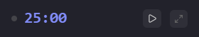
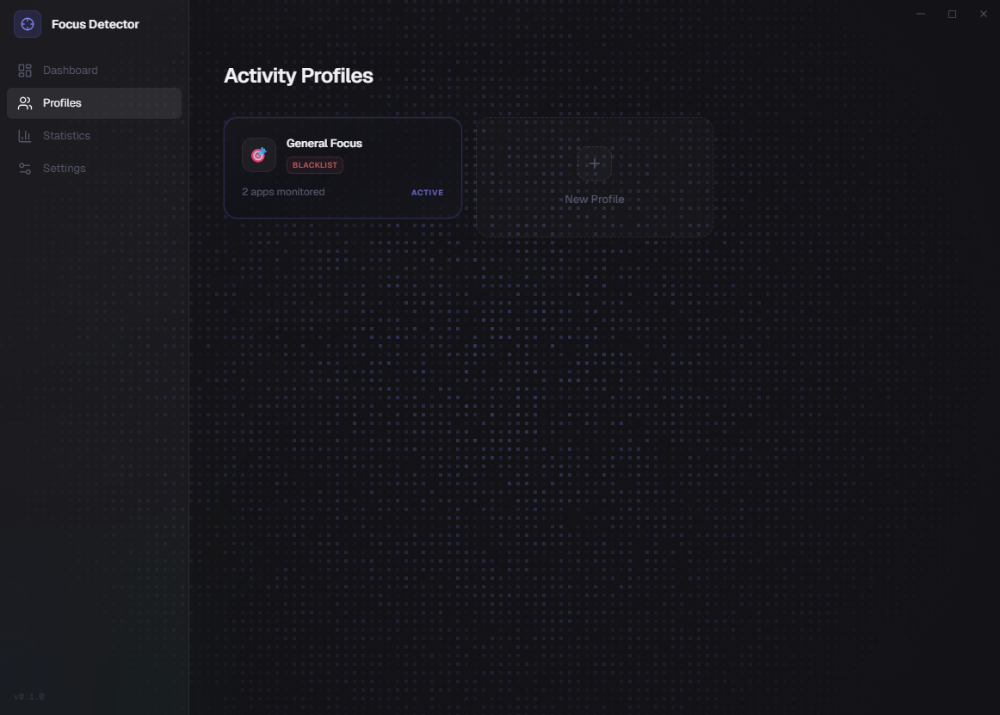
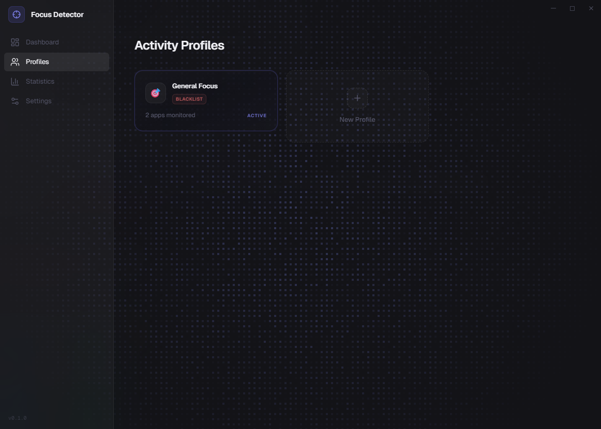
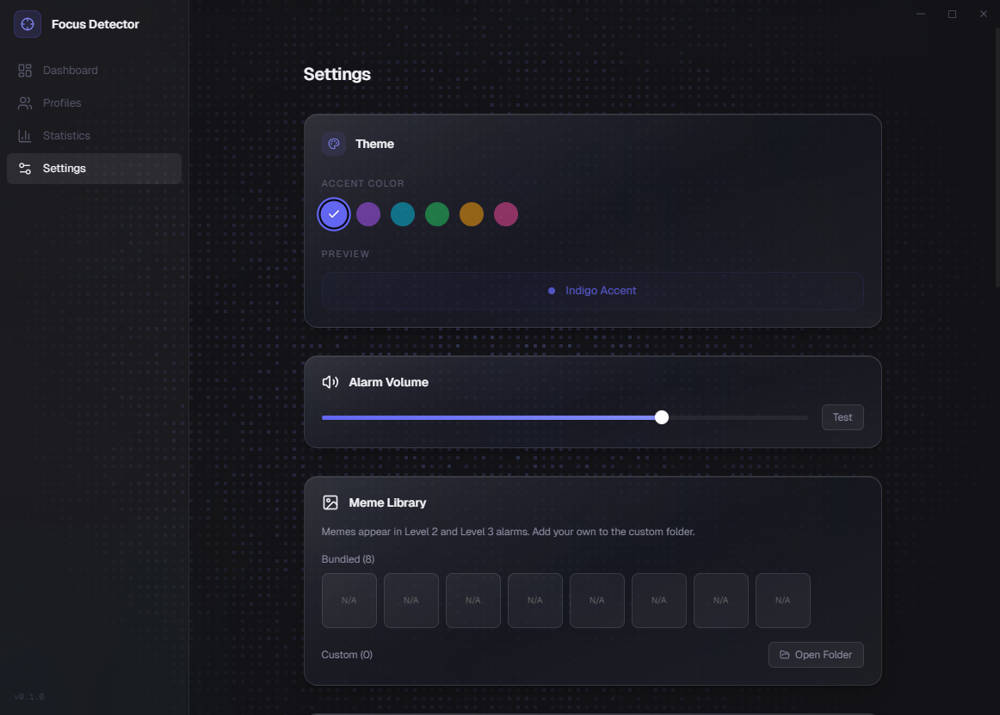

<p align="center">
  
</p>

<h1 align="center">Focus Detector</h1>

<p align="center">
  A desktop app that watches your screen and won't let you procrastinate.<br/>
  Tauri 2 &middot; React 19 &middot; Rust &middot; AI Vision &middot; Windows
</p>

<p align="center">
  
  
  
  
  
</p>

---

## What this does

You start a Pomodoro session. Focus Detector checks your active window once per second. If you drift to YouTube, Reddit, Twitter, or anything not on your profile's allow-list, it gives you a 10-second grace period to come back. If you don't, it escalates:

| Level | What happens |
|-------|-------------|
| **L1** | A small toast. A gentle chime. You probably ignored it. |
| **L2** | A centered modal with a meme roasting you. Alert tone. |
| **L3** | Fullscreen takeover. Siren. Glitch effects. Screen shake. The window goes always-on-top. You're not Alt-Tabbing out of this one. |

The alarm level is set per profile, not auto-escalating — you choose your own punishment in advance.

For ambiguous cases (you're in Chrome but the matching engine can't tell if that tab is work or not), it takes a screenshot and sends it to an AI vision model. Four-provider fallback chain: local Ollama first, then Gemini, Groq, OpenRouter. If the AI says you're off-task with >50% confidence, the grace period starts.

## Screenshots

### Dashboard


The main view. 25-minute Pomodoro ring with gradient glow, start/pause controls, cycle tracker, and today's focus time.

### Widget


Always-on-top 340x52px floating timer. Shows countdown, detection status dot, and quick controls. Syncs with the main window via localStorage polling.

### Statistics


Focus percentage donut, 5-minute granularity timeline (focus/distraction/break segments), today's summary cards, and top distractor apps ranked by frequency.

### Profiles


Profile cards showing detection mode (whitelist/blacklist), monitored app count, and active status. Each profile has its own Pomodoro config, detection rules, and alarm level.

### Settings


Theme customization (6 accent colors), alarm volume with live preview, and meme library browser (bundled + custom). AI provider keys and autostart config below the fold.

## Architecture

Two processes. Rust handles the OS. React handles everything else.

```
┌─────────────────────────────────────────────────────────┐
│  React Frontend (all business logic)                    │
│                                                         │
│  ┌──────────┐  ┌──────────────┐  ┌──────────────────┐  │
│  │ Pomodoro │  │  Detection   │  │    AI Vision     │  │
│  │   FSM    │  │  Pipeline    │  │  Provider Chain  │  │
│  │          │  │  (1s loop)   │  │                  │  │
│  │ work →   │  │  window →    │  │  Ollama (local)  │  │
│  │ break →  │  │  match →     │  │  → Gemini        │  │
│  │ work →   │  │  classify →  │  │  → Groq          │  │
│  │ long     │  │  act         │  │  → OpenRouter    │  │
│  └──────────┘  └──────┬───────┘  └────────▲─────────┘  │
│                       │                    │            │
│                       │  ambiguous?        │ screenshot │
│                       └────────────────────┘            │
│                                                         │
│  ┌─ State ──────────────────────────────────────────┐   │
│  │ AppContext — single React Context for everything │   │
│  │ profiles, timer, detection, alarm, stats         │   │
│  └──────────────────────────────────────────────────┘   │
│                         ▲ IPC                           │
├─────────────────────────┼───────────────────────────────┤
│  Rust Backend           │                               │
│  ┌──────────────┐  ┌────┴─────┐  ┌──────────────────┐  │
│  │ active-win-  │  │ xcap     │  │ tauri-plugin-sql │  │
│  │ pos-rs       │  │ screen   │  │ (SQLite)         │  │
│  │              │  │ capture  │  │                  │  │
│  │ {title,      │  │          │  │ profiles,        │  │
│  │  process}    │  │ PNG →    │  │ sessions,        │  │
│  │              │  │ base64   │  │ distractions,    │  │
│  └──────────────┘  └──────────┘  │ settings         │  │
│                                  └──────────────────┘  │
│  System tray · Widget window · Autostart · Vibrancy    │
└─────────────────────────────────────────────────────────┘
```

### Detection pipeline

This is the core of the app. Runs every second during a work phase.

```
get_active_window_info()
  │
  ▼
matchingEngine(window, profile)
  │
  ├── on_task ──────────────► clear grace, dismiss alarm
  │
  ├── off_task ─────────────► start grace countdown (10s)
  │                                │
  │                                ▼  still off-task?
  │                           fire alarm (L1/L2/L3)
  │
  └── ambiguous ────────────► cooldown elapsed? (30s)
                                   │
                              yes? ▼
                         capture_screenshot()
                              │
                              ▼
                     AI vision analysis
                              │
                    confidence ≥ 0.5? ──► off_task path
                    confidence < 0.5? ──► on_task (benefit of doubt)
```

The matching engine knows about 11 browser processes (Chrome, Edge, Firefox, Brave, Opera, Arc, Whale, Vivaldi, Thorium, Ungoogled-Chromium, Chromium). It matches site patterns against window titles — `youtube.com` catches `"Some Video - YouTube"` by stripping the TLD and doing a case-insensitive substring match.

### Multi-window setup

| Window | Size | Purpose |
|--------|------|---------|
| **Main** | 1200x800 | Dashboard, profiles, stats, settings. Custom titlebar, no OS decorations. |
| **Widget** | 340x52 | Always-on-top floating timer. Transparent background, draggable. |

The two windows sync through `localStorage` polling at 1s intervals — not Tauri IPC. The widget reads `widget-sync` for state and writes `widget-action` for commands. Timestamp-based deduplication prevents double-fires. If data goes stale (>5s old), the widget dims itself.

## Tech stack

| Layer | Tech |
|-------|------|
| Desktop framework | Tauri 2 |
| Frontend | React 19, TypeScript 5.6 |
| Styling | Tailwind CSS 4.2 |
| Animation | Framer Motion 12 |
| Icons | Lucide React |
| Routing | React Router 7 |
| Testing | Vitest, Testing Library, jsdom |
| Backend | Rust 2021 edition |
| Window detection | `active-win-pos-rs` |
| Screen capture | `xcap` |
| Database | SQLite via `tauri-plugin-sql` |
| Window effects | `window-vibrancy` (Windows Acrylic) |
| Autostart | `tauri-plugin-autostart` |

## Getting started

### Prerequisites

- [Node.js](https://nodejs.org/) (LTS)
- [Rust](https://rustup.rs/) (stable)
- [Tauri prerequisites](https://v2.tauri.app/start/prerequisites/) for Windows
- An AI vision provider (optional — Ollama for local, or a Gemini/Groq/OpenRouter API key)

### Install and run

```bash
git clone https://github.com/YOUR_USERNAME/focus-detector.git
cd focus-detector
npm install
npm run dev
```

This starts the Vite dev server on port 1420 and opens the Tauri window with hot-reload.

### Build

```bash
npm run build
```

Runs TypeScript type-check, bundles with Vite, and compiles the Tauri binary.

### Test

```bash
npm test              # Run all tests (140+)
npm run test:watch    # Watch mode
```

## How it works

### Profiles

Profiles define what counts as distraction. Each profile has:

- **Mode**: `whitelist` (everything not listed is a distraction) or `blacklist` (everything listed is a distraction)
- **App rules**: Process name + optional site patterns. `chrome.exe` with `["youtube.com", "reddit.com"]` blocks those specific sites in Chrome while allowing everything else.
- **Pomodoro config**: Work duration, short/long break, cycles before long break
- **Detection config**: AI check cooldown (default 30s), grace countdown (default 10s), alarm level (1-3)

The default profile ships with YouTube, Reddit, and Twitter blocked across Chrome, Edge, and Whale.

### AI vision

When the matching engine returns `ambiguous` (browser is open but no site rule matches), the app screenshots your screen and asks an AI model: *"The user should be doing [profile context]. Based on this screenshot, are they on task?"*

The AI returns structured JSON:
```json
{
  "onTask": false,
  "confidence": 0.82,
  "reason": "User is browsing social media feed"
}
```

Response guards validate the output — if `onTask` isn't a boolean or `confidence` isn't in `[0, 1]`, it falls back to on-task. The system gives you the benefit of the doubt by default (`confidence < 0.5` = on-task).

Provider priority: **Ollama** (runs locally, no API key needed) → **Gemini** → **Groq** → **OpenRouter**. Configure keys in Settings.

### Alarm system

Sounds use the Web Audio API. Primary path loads `.mp3` files from `/public/sounds/`. If files are missing, it falls back to oscillator-generated audio:
- L1: 440Hz → 660Hz ascending chime
- L2: 880/660/880 Hz pattern, plays twice
- L3: Sawtooth wave oscillating 880Hz ↔ 440Hz (siren)

L2 and L3 alarms display memes — 8 bundled GIFs ship with the app, and you can drop custom images into `appDataDir/memes/custom/`. The selector uses Fisher-Yates shuffle with no-repeat-until-exhausted.

### Celebrations

Completing a work phase fires confetti (via `canvas-confetti`) and plays a phase chime. Milestone toasts appear at 5, 10, and 25 sessions in a day.

### Stats tracking

Every session persists to SQLite: focus seconds, distraction seconds, alarm counts by level, cycles completed. The stats page shows:
- Weekly focus bar chart
- Focus ring (donut chart)
- 5-minute granularity timeline
- Top distractor leaderboard
- Current and best day streaks

## Design

Dark-only. The aesthetic is "Dark Precision Glass" — visionOS-inspired layered translucent surfaces with intentional depth.

- **Typography**: Satoshi (display), Geist (body), Geist Mono (timer/data)
- **Accent**: `#6366f1` (indigo) — used for the timer ring, active states, primary actions
- **Glass surfaces**: `backdrop-blur(40px)` + `saturate(1.8)` + gradient overlays. The `GlassCard` component has four modes: `interactive` (pointer-tracking specular highlight), `hoverable`, `tint` (colored wash), and `glow` (border glow)
- **Background**: `#0a0a12` with Windows Acrylic vibrancy applied via Rust
- **Motion**: Framer Motion — `whileTap`, `AnimatePresence`, layout animations. 100-400ms durations with ease-out/ease-in curves.

## Project structure

```
src/
├── components/
│   ├── alarm/          # L1 toast, L2 modal, L3 fullscreen + glitch/shake/particles
│   ├── detection/      # Detection status indicator
│   ├── layout/         # Custom titlebar, sidebar (56px collapsed, 220px on hover)
│   ├── profiles/       # Profile cards, editor
│   ├── settings/       # AI config, volume, memes, theme, autostart, data export
│   ├── stats/          # Charts, streaks, distractors, timeline
│   ├── timer/          # Pomodoro SVG ring, controls
│   └── ui/             # GlassCard, Confetti, Toast, NeonButton
├── context/            # AppContext — single source of truth for all state
├── hooks/              # usePomodoro, useDetection, useProfiles, useStats
├── lib/                # Pomodoro FSM logic, utilities
├── pages/              # Dashboard, Profiles, Stats, Settings, Widget
├── services/
│   ├── detectionPipeline.ts    # The 1-second loop
│   ├── matchingEngine.ts       # Rule matching (browsers, sites, apps)
│   ├── visionService.ts        # AI provider chain + response parsing
│   ├── alarmSound.ts           # Web Audio + oscillator fallback
│   ├── memeService.ts          # Bundled + custom meme selection
│   ├── sessionService.ts       # SQLite session CRUD + stat queries
│   └── ...                     # profile, settings, screenshot services
└── types/              # TypeScript interfaces

src-tauri/
├── src/
│   ├── lib.rs          # App setup, IPC handler registration
│   ├── detection.rs    # get_active_window_info, capture_screenshot, list_running_apps
│   ├── tray.rs         # System tray, widget window management
│   ├── monitors.rs     # Monitor enumeration
│   └── memes.rs        # Custom meme file scanning
├── migrations/
│   └── 001_init.sql    # Schema: profiles, sessions, distractions, settings
└── Cargo.toml
```

## Database schema

Four tables in SQLite:

```sql
profiles     -- name, icon, mode (whitelist/blacklist), apps (JSON), pomodoro config, detection config
sessions     -- per-work-phase: timestamps, focus_seconds, distraction_seconds, alarm counts by level
distractions -- individual off-task events: app, window title, alarm level, timestamp
settings     -- key-value store for API keys, volume, theme, preferences
```

## Development

```bash
npm run dev           # Vite (port 1420) + Tauri window with hot-reload
npm run tauri dev     # Alternative: direct Tauri dev command
npm test              # Vitest — 140+ tests
npm run test:watch    # Watch mode

# Rust only (from src-tauri/)
cargo check           # Type-check without building
cargo build           # Full build
```

No linter is configured. TypeScript strict mode is on.

## Roadmap

- [ ] Global hotkeys (`Ctrl+Shift+P` pause, `Ctrl+Shift+S` skip)
- [ ] First-run onboarding flow
- [ ] Content Security Policy configuration
- [ ] ProfileEditor component refactor (currently 796 lines)
- [ ] Dead code cleanup (alarm overlay window is never invoked)

## License

Not yet specified.
